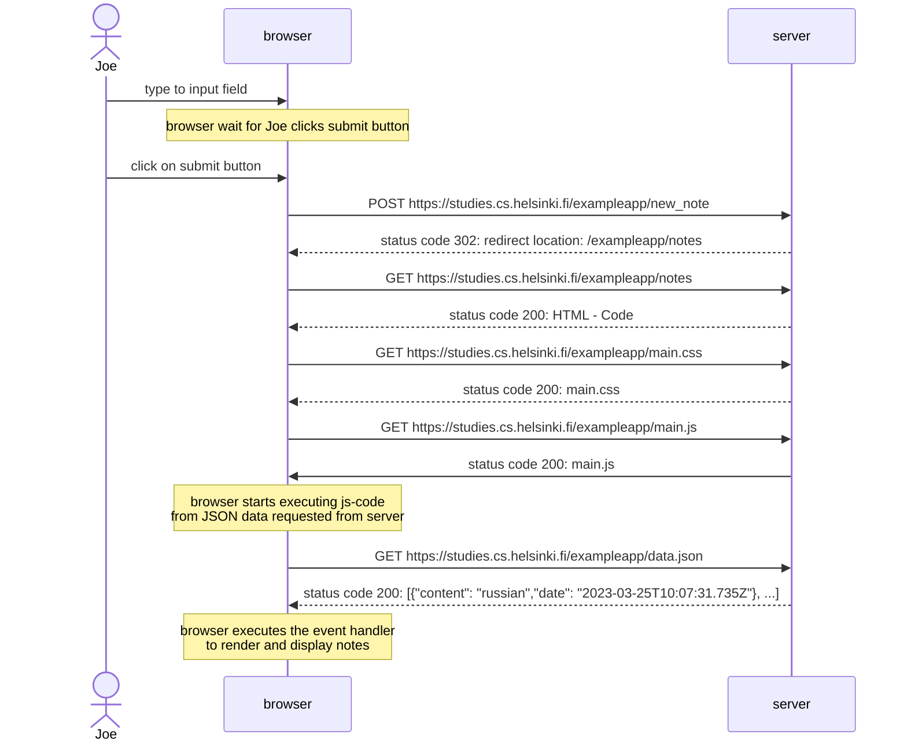

```mermaid
sequenceDiagram

Actor Joe

Joe->>browser: type to input field
note over browser: browser wait for Joe clicks submit button
Joe->>browser: click on submit button
browser->>server: POST https://studies.cs.helsinki.fi/exampleapp/new_note
server-->>browser: status code 302: redirect location: /exampleapp/notes

browser->>server: GET https://studies.cs.helsinki.fi/exampleapp/notes
server-->>browser: status code 200: HTML - Code
browser->>server: GET https://studies.cs.helsinki.fi/exampleapp/main.css
server-->>browser: status code 200: main.css
browser->>server: GET https://studies.cs.helsinki.fi/exampleapp/main.js
server->>browser: status code 200: main.js

note over browser: browser starts executing js-code <br>from JSON data requested from server 

browser->>server: GET https://studies.cs.helsinki.fi/exampleapp/data.json
server-->>browser: status code 200: [{"content": "russian","date": "2023-03-25T10:07:31.735Z"}, ...]

note over browser: browser executes the event handler <br>to render and display notes 


```
