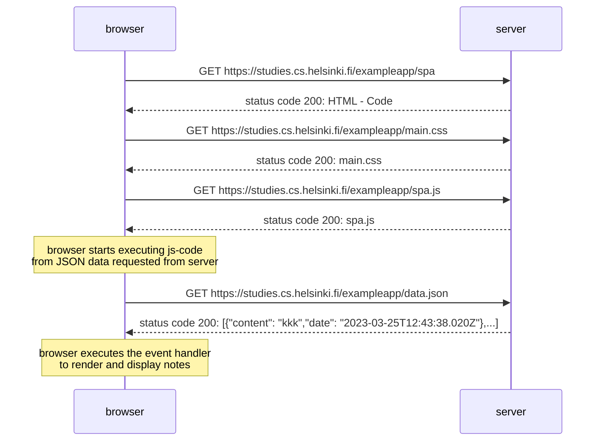

```mermaid
sequenceDiagram

browser->>server: GET https://studies.cs.helsinki.fi/exampleapp/spa
server-->>browser: status code 200: HTML - Code
browser->>server: GET https://studies.cs.helsinki.fi/exampleapp/main.css
server-->>browser: status code 200: main.css
browser->>server: GET https://studies.cs.helsinki.fi/exampleapp/spa.js
server-->>browser: status code 200: spa.js

note over browser: browser starts executing js-code <br>from JSON data requested from server 

browser->>server: GET https://studies.cs.helsinki.fi/exampleapp/data.json
server-->>browser: status code 200: [{"content": "kkk","date": "2023-03-25T12:43:38.020Z"},...]

note over browser: browser executes the event handler <br>to render and display notes


```
