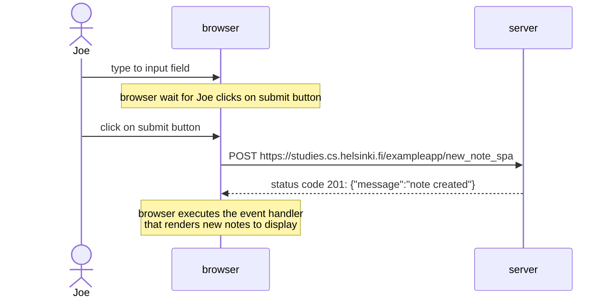

```mermaid
sequenceDiagram

actor Joe

Joe->>browser: type to input field
note over browser: browser wait for Joe clicks on submit button
Joe->>browser: click on submit button

browser->>server: POST https://studies.cs.helsinki.fi/exampleapp/new_note_spa
server-->>browser: status code 201: {"message":"note created"}

note over browser: browser executes the event handler <br>that renders new notes to display
```

